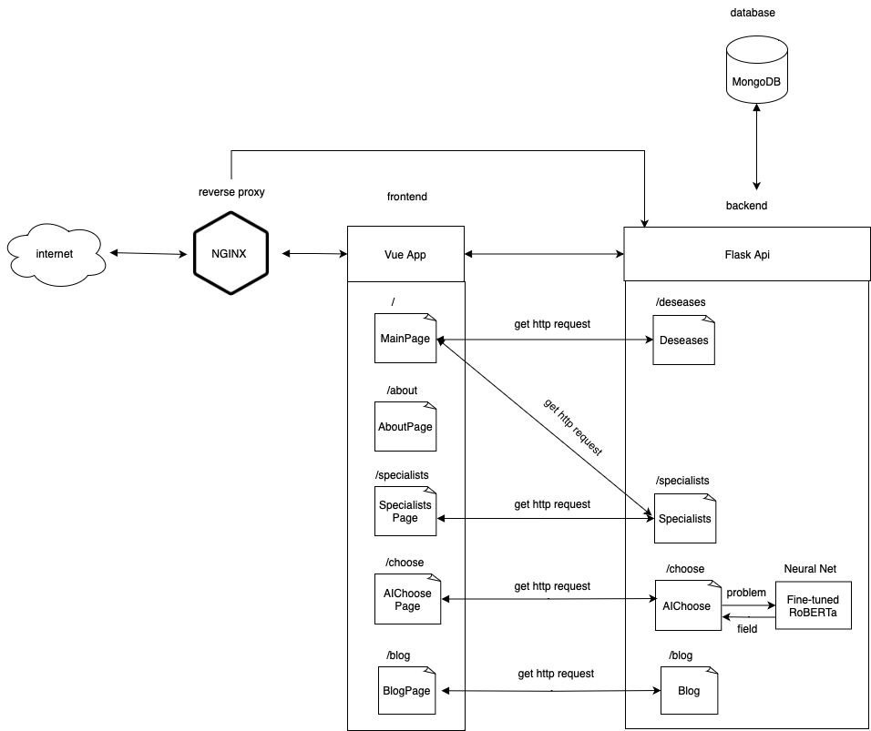

<p align="center">
  
</p>
<p align="center">
    <h1 align="center">DBTWEB</h1>
</p>
<p align="center">
    <em><code>Сервис для специалистов диалектической поведенческой терапии
</code></em>
</p>
<p align="center">
	<!-- local repository, no metadata badges. -->
<p>
<p align="center">
		<em>Developed with the software and tools below.</em>
</p>
<p align="center">
	
    
	
	
</p>
<hr>

##  Quick Links

> - [ Overview](#-overview)
> - [ Features](#-features)
> - [ Architecture ](#-architecture)
>   - [ Installation](#-installation)
>   - [ Running ](#-running)
>   - [ Tests](#-tests)
> - [ Contributing](#-contributing)
> - [ License](#-license)

---

##  Overview

<code>WEB приложение для специалистов диалектической поведенческой терапии. </code> \
Основные возможности:
1. выбора специалиста
2. просмотр статей на интересующую тему
3. подбор специалиста с помощью ИИ
4. интеграция со сторонними сайтами: yclients и telegraph


---

##  Features

1. бэкенд на основе Flask Api
2. фронтенда на основе Vue JS
3. использование MongoDB
4. использование NGINX для проксирование запросов
5. поднятие всех микросервисов с помощью Docker
6. использование трансформерных моделей для перевода и классификации текста
---

##  Architecture

Подробная документация разработчика для backend части: [backend/README.md](backend/README.md) \
Подробная документация разработчика для frontend части: [frontend/README.md](frontend/README.md)

###  Installation

1. Клонируйте репозиторий:

```sh
git clone https://github.com/Mishlen337/DBTweb
```

2. Перейдите в рабочую директорию:

```sh
cd DBTweb
```

### Running
3. Сбилдите и запустите контейнеры:

```sh
docker-compose up --build -d
```


---

##  Contributing

- **[Submit Pull Requests](https://github.com/Mishlen337/DBTweb/pulls)**: Создавайте свои собственные Pull requests для внесения вклада в проект
- **[Join the Discussions](https://github.com/Mishlen337/DBTweb/discussions)**: Делитесь своим мнением, предлагайте новое в обсуждении
- **[Report Issues](https://github.com/Mishlen337/DBTweb/issues)**: Укажите баги возникшие при работе сайта.

---

##  License

Данный проект не защищен никакой лицензией, что позволяет использовать его в своих проектах.

---

